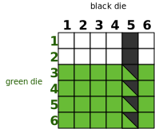
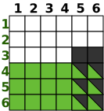
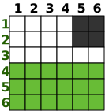

(In)Dependence / (Non-)Disjoint
---

In this section, we give theoritical examples of the different relationships between events: independent and non-disjoint, independent and disjoint, dependent and non-disjoint, dependent and disjoint.
Based on this example, we explain why only independent and non-disjoint relationship is relevant in our case. We then give an example based on Luxembourg smart grid.

# Some reminders

## Sample space, outcome and event

A **sample space** contain all possible outcomes. We denote it with S.<br>
An **event** is a set of outcomes. This set can contain from no element to all elements.<br>
**Notice:** we cannot apply probabilities operations over outcomes that belong to different sample space.

<u>Example:</u>
- S = {tail, heads} for a coin flip
- S = {open, closed} for a fuse state
- S = {open and someone, open and noone, close and someone, close and someone} for couples (door state, presence)
- S = { i> -273.5 | i real}, for a temperature

## Independence

Two events are defined as independent if the probability of the first one do not impact the probability of the second one.

## Disjoint

Two events are defined as disjoint if they do not share any outcome.

# Independent and non-disjoint

## Theoritical example

- Let say that we have two dices: a green and a black one
- We roll them once
- Sample space S = {(i,j) | 0 <= i <= 6; 0 <= j <= 6}
    - i represents green die
    - j represents black die
- Let A a Bernoulli variable
    - A is equal to 1 if the green die is superior or equal to 3 (i >= 3)
    - A is equal to 0 otherwise
- Let B a Bernoulli variable
    - B is equal to 1 if the black die is equals to 5
    - B is equal to 0 otherwise
- Let event E1 contains all outcommes that satisfy Bernoulli A variable
- Let event E2 contains all outcommes that satisfy Bernoulli B variable

In the below schema, we represent all the possible outcomes of S: one cell represents one outcome.
We consider that we use two fair dices. So all outcomes are equally likely distributed: P(outcome) = 1 / #outcomes. We depicted in green all outcomes that correspond to A=1 (event E1) and in black for outcomes that correspond to B=1 (event E2).



**Probability of A to be equal to 1**: P(A=1) = P(E1) = 24/36 = 2/3 *(cell with green background)*<br>
**Probability of A to be equal to 0**: P(A=0) = 1 - P(A=1) = 1 - 2/3 = 1/3<br>
**Probability of B to be equal to 1**: P(B=1) = P(E2) = 6/36 = 1/6 *(cell with black background)*<br>
**Probability of B to be equal to 0**: P(B=0) = 1 - P(B=1) = 1 - 1/6 = 5/6<br>
**Probability of B to be equal to 1 and A to be equal to 1**: P(A=1 && B=1) = 4/36 = 1/9 *(cell with black and green background)*<br>
P(A=1)*P(B=1) = 2/3 * 1/6 = 1/9

E1 and E2 are two independent events. *P(A=1 && B=1) == P(A=1) \* P(B=1)*<br>
As E1 and E2 share a set of outcomes ((3,5), (4,5), (5,5) and (6,5)), they are non-disjoint.

## Smart grid example

- Let say that we have two cabinets
- Each cabinet has 1 fuse
- A fuse can have two states: closed and open
- Sample space S = {(i,j) | i={closed or open}, j={closed or open}}
- Let's A a Bernoulli variable
    - A is equal to 1 if the first fuse is closed *(green)*
    - A is equal to 0 otherwise
- Let's event B a Bernoulli variable
    - B is equal to 1 if the second fuse is closed *(black)*
    - B is equal to 0 otherwise
- Let event E1 contains all outcommes that satisfy Bernoulli A variable
- Let event E2 contains all outcommes that satisfy Bernoulli B variable

In the below schema, we represent all the possible outcomes of S: one cell represents one outcome.
Here, the outcome are not equally likely distributed. It meeans that each outcome has its own probability. We depicted in green all outcomes that correspond to A=1 (event E1) and in black for outcomes that correspond to B=1 (event E2).


*[No mathematical proof as we do not have the probabilities]* These two variables are independent. Indeed, as we can imagine, the fuse state will not impact the state of the other fuse.
As E1 and E2 share one outcome ((open,open)), they are non-disjoint.

**This example is thus relevant in our case.**


# Independent and disjoint

Only happen if one of the two variable has probability equaled to 0 to be equal to 1.
*(Mathematically prooved)*

**This example is not thus relevant in our case.**

# Dependent and non-disjoint

## Theoritical example

- Let say that we have two dices: a green and a black one
- We roll them once
- S = {(i,j) | 0 <= i <= 6; 0 <= j <= 6}
    - i represents green die
    - j represents black die
- Let's A a Bernoulli variable
    - A is equal to 1 if the green die is superior or equal to 4 (i >= 4) *(green)*
    - A is equal to 0 otherwise
- Let's event B a Bernoulli variable
    - B is equal to 1 if the black die is superior or equal to 4 and green die is strictly superior to 3 (i >= 3 and j >= 5 ) *(black)*
    - B is equal to 0 otherwise
- Let event E1 contains all outcommes that satisfy Bernoulli A variable
- Let event E2 contains all outcommes that satisfy Bernoulli B variable

In the below schema, we represent all the possible outcomes of S: one cell represents one outcome.
We consider that we use two fair dices. So all outcomes are equally likely distributed: P(outcome) = 1 / #outcomes. We depicted in green all outcomes that correspond to A=1 (event E1) and in black for outcomes that correspond to B=1 (event E2).



**Probability of A to be equal to 1**: P(A=1) = 18/36 = 1/2 *(cell with green background)*<br>
**Probability of A to be equal to 0**: P(A=0) = 1 - P(A=1) = 1 - 1/2 = 1/2<br>
**Probability of B to be equal to 1**: P(B=1) = 8/36 = 2/9 *(cell with black background)*<br>
**Probability of B to be equal to 0**: P(B=0) = 1 - P(B=1) = 1 - 2/9 = 7/9<br>
**Probability of B to be equal to 1 and A to be equal to 1**: P(A=1 && B=1) = 6/36 = 1/6 *(cell with black and green background)*<br>
P(A=1)*P(B=1) = 1/2 * 2/9 = 1/9

E1 and E2 are two dependent variables. *P(A=1 && B=1) != (P(A=1)\*P(B=1))*<br>
As E1 and E2 share a set of outcomes ((4,5), (5,5), (6,5), (4,6), (5,6) and (6,6)), they are non-disjoint. 


## Smart grid example

- Let's consider two paralleles cable of the grid
- Cables have a load l superior or equal to 0
- S = {(i,j) | i= load cable 1, j=load cable 2}
- Let's A a Bernoulli variable
    - A is equal to 1 if the cable is connected *(green)*
    - A is equal to 0 otherwise
- Let's event B a Bernoulli variable
    - B is equal to 1 if there is no load and the cable is connected *(black)*
    - B is equal to 0 otherwise
- Let event E1 contains all outcommes that satisfy Bernoulli A variable
- Let event E2 contains all outcommes that satisfy Bernoulli B variable

In the below schema, we represent all the possible outcomes of S: one cell represents one outcome.
Here, the outcome are not equally likely distributed. It meeans that each outcome has its own probability. We depicted in green all outcomes that correspond to A=1 (event E1) and in black for outcomes that correspond to B=1 (event E2).


These two variables are:

- dependent as the definition of variable B is made by applying a condition on variable A *indirectly*
- non-disjoint as we can see as both event can happen in the same time (there is no bi-color cell)


*[No mathematical proof as we do not have the probabilities]* These two variables are dependent by definition.
As A and B share one outcome ((connect.,no-load)), they are non-disjoint.

Even if we were able to define two Bernoulli variables that are based on dependent and non-disjoint events. However, from a developper point of view, combining these two events is pointless. By definition, B is computed using the value of A. If we would have to code this in a programming language, we will get something like:

```
Cable c = ...
boolean A = c.isConnected();
boolean B = A && c.load() > 0;
```

As B is computing with A, there is no reason to recombine them:

```
boolean D = A & B = A && A && c.load() > 0 = A & c.load() = B;
boolean C = A || B = A || (A & c.load() > 0) = A;
```

A | c.load() > 0 | A & c.load() > 0 |  A \|\| (A & c.load() > 0)
--|--------------|------------------|---------------------------
1 |     1        |       1          |           1
1 |     0        |       0          |           1
0 |     1        |       0          |           0
0 |     0        |       0          |           0

**It is not relevant in our case to implement this probability rule.**


# Dependent and disjoint

## Theoritical example

- Let say that we have two dices: a green and a black one
- We roll them once
- S = {(i,j) | 0 <= i <= 6; 0 <= j <= 6}
    - i represents green die
    - j represents black die
- Let's A a Bernoulli variable
    - A is equal to 1 if the green die is superior or equal to 4 (i >= 4)
    - A is equal to 0 otherwise
- Let's event B a Bernoulli variable
    - B is equal to 1 if the black die is superior or equal to 4 and green die is strictly superior to 3 (i <= 2 and j >= 5 )
    - B is equal to 0 otherwise
- Let event E1 contains all outcommes that satisfy Bernoulli A variable
- Let event E2 contains all outcommes that satisfy Bernoulli B variable

In the below schema, we represent all the possible outcomes of S: one cell represents one outcome.
We consider that we use two fair dices. So all outcomes are equally likely distributed: P(outcome) = 1 / #outcomes. We depicted in green all outcomes that correspond to A=1 (event E1) and in black for outcomes that correspond to B=1 (event E2).



**Probability of A to be equal to 1**: P(A=1) = 18/36 = 1/2 *(cell with green background)*<br>
**Probability of A to be equal to 0**: P(A=0) = 1 - P(A=1) = 1 - 1/2 = 1/2<br>
**Probability of B to be equal to 1**: P(B=1) = 4/36 = 1/9 *(cell with black background)*<br>
**Probability of B to be equal to 0**: P(B=0) = 1 - P(B=1) = 1 - 1/9 = 8/9<br>
**Probability of B to be equal to 1 and A to be equal to 1**: P(A=1 && B=1) = 0/36 = 0 *(cell with black and green background)*<br>
P(A=1)*P(B=1) = 1/2 * 1/9 = 1/18

E1 and E2 are two dependent variables. *P(A=1 && B=1) != (P(A=1)\*P(B=1))*<br>
As E1 and E2 do not share a set of outcomes, they are disjoint.


## Smart grid example

- Let's consider two paralleles cable of the grid
- Cables have a load l superior or equal to 0
- S = {(i,j) | i= load cable 1, j=load cable 2}
- Let's A a Bernoulli variable
    - A is equal to 1 if the cable is connected *(green)*
    - A is equal to 0 otherwise
- Let's event B a Bernoulli variable
    - B is equal to 1 if there is no load and the cable is disconnected *(black)*
    - B is equal to 0 otherwise
- Let event E1 contains all outcommes that satisfy Bernoulli A variable
- Let event E2 contains all outcommes that satisfy Bernoulli B variable

In the below schema, we represent all the possible outcomes of S: one cell represents one outcome.
Here, the outcome are not equally likely distributed. It meeans that each outcome has its own probability. We depicted in green all outcomes that correspond to A=1 (event E1) and in black for outcomes that correspond to B=1 (event E2).


These two variables are:

- dependent as the definition of variable B is made by applying a condition on variable A *indirectly*
- non-disjoint as we can see as both event can happen in the same time (there is no bi-color cell)


*[No mathematical proof as we do not have the probabilities]* These two variables are dependent by definition.
As A and B share one outcome ((connect.,no-load)), they are non-disjoint.

For the same reason explained in [Dependent and non-disjoint](#smart-grid-example-1), **it is not relevant in our case to implement this probability rule.** 
